# Comprendre les données Qualicharge

Les données Qualicharge sont définies unitairement (champ par champ) dans les schémas de données [IRVE statique](https://schema.data.gouv.fr/etalab/schema-irve-statique/2.3.1/documentation.html) et [IRVE dynamique](https://schema.data.gouv.fr/etalab/schema-irve-dynamique/2.3.1/documentation.html).

Ces définitions sont également complétées dans la [documentation des API de Qualicharge](https://fabrique-numerique.gitbook.io/qualicharge) par la description des contrôles et règles appliquées.

Ce document, complémentaires aux deux précédents, présente la structuration des données et leur interdépendance.

Le formalisme utilisé est celui des modèles conceptuels de données et en particulier le modèle entité-association (voir le [guide data.gouv.fr: "bien documenter un jeu de données"](https://guides.data.gouv.fr/guides-open-data/guide-qualite/documenter-des-donnees/bien-documenter-un-jeu-de-donnees)).

Il est à noter qu'un modèle conceptuel aborde la sémantique des données. Il ne préjuge pas des implémentations physiques mises en oeuvre (ex structure de base de données). Celles-ci font l'objet de représentations dédiées (modèle physique de données).

## Structure des données

### Structure de recharge

Les données Qualicharge sont organisées autour des notions de `station de recharge` et de `point de recharge`.

Ces notions correspondent à celles définies par la réglementation AFIR (Alternative Fuels Infrastructure - [règlement UE 2023/1804 du 13/09/2023](https://eur-lex.europa.eu/eli/reg/2023/1804/oj)):

  "***point de recharge**: une interface fixe ou mobile, sur réseau ou hors réseau, qui permet de transférer de l’électricité vers un véhicule électrique et qui, bien qu’elle puisse être équipée d’un ou de plusieurs connecteurs pour prendre en charge différents types de connecteurs, n’est capable de recharger qu’un seul véhicule électrique à la fois, à l’exclusion des dispositifs d’une puissance de sortie inférieure ou égale à 3,7 kW dont la fonction principale n’est pas de recharger des véhicules électriques*"

  "***station de recharge**: une installation physique en un lieu spécifique, composée d’un ou de plusieurs points de recharge*"

La notion de point de recharge est explicite dans sa formulation. La notion de station de recharge nécessite néanmoins une explication complémentaire :

- la station de recharge est définie dans la règlementation AFIR au travers des informations qui lui sont associées. On peut ainsi la définir comme étant un regroupement de points de recharge partageant des informations identiques. Par exemple :
  - une même localisation géographique (coordonnées),
  - un raccordement électrique commun (Point de Livraison)
  - un même rattachement administratif (propriétaire, opérateur, aménageur),
  - des conditions tarifaires identiques,
  - des propriétés communes (accessibilité, horaires)

  Ainsi, par exemple, deux points de recharge ne partageant pas la même localisation ne pourront être associés à la même station.
  
  Le périmètre d'une station reste a l'appréciation des opérateurs et aménageurs (il peut être restreint à quelques points de recharge ou au contraire regrouper plusieurs dizaines de points de recharge).

  Dans le cadre de Qualicharge la notion de station est conforme à la notion présentée dans la règlementation AFIR.

Cette structure de recharge peut être représentée sous la forme d'un modèle entité-association :

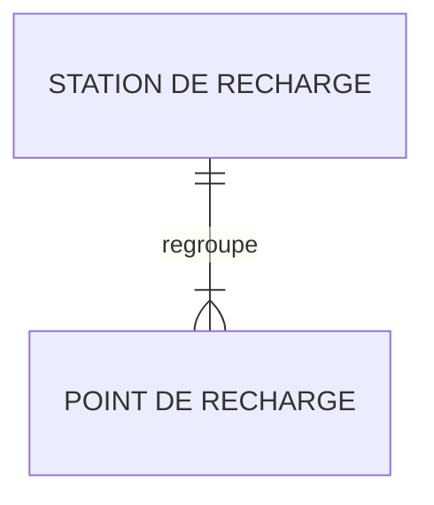

> *Chaque entité est représentée par un nom et modélisé par une "boîte".*
> *L'association entre deux entités est représentée par une ligne dont les extrémités expriment la "cardinalité" :*
> | *représentation* | *signification*   |
> | ---------------- | ----------------- |
> | \|\|             | *Un seul*         |
> | }\|              | *Un ou plusieurs* |

Ce modèle exprime qu'une station de recharge regroupe un ou plusieurs points de recharge et qu'un point de recharge n'appartient qu'à une seule station de recharge.

***Nota :***

La règlementation AFIR définit la notion complémentaire de parc de recharge:

- "***parc de recharge**: une ou plusieurs stations de recharge en un lieu spécifique*"

Le parc de recharge ne fait référence à aucune activité de gestion mais est associé exclusivement aux exigences règlementaires portant sur un lieu. Ainsi un parc regroupe par exemple toutes les stations d'une aire de service autoroutière ou bien d'une gare ou d'un aéroport. Il reflète en ce sens le besoin usager de recharge en un lieu donné.

La notion de parc de recharge est utilisée dans Qualicharge pour l'évaluation des exigences AFIR. Elle n'est pas abordée dans cette présentation.

### Structure physique

L'intégration d'une station de recharge dans son environnement est représentée par deux notions complémentaires :

- **localisation** : localisation géographique et administative d'une station
- **point de livraison** : référence géographique ou se situe le point de connexion (organe de coupure avec les ouvrages électriques du réseau public)

Ces deux notions sont associées à la station :

- une station est associée à une seule localisation physique et à un seul raccordement au réseau électrique public.

Le modèle associé est le suivant :

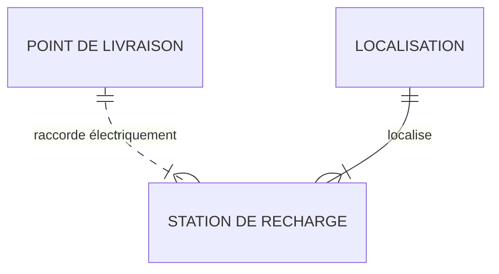
Ce modèle prend en compte plusieurs configurations possibles :

- plusieurs stations avec un même point de livraison et une même localisation (ex. une station par niveau d'un parking sur plusieurs niveaux),
- plusieurs stations avec un même point de livraison et des localisations différentes (ex. stations d'un même site),
- plusieurs stations avec des points de livraison différents et une même localisation (ex. augmentation de capacité par ajout d'une station et d'un point de livraison)
  
Il est à noter que ces deux notions sont associées à la station de recharge et non au point de recharge.
Ceci implique que deux points de recharge d'une même station ne peuvent avoir des localisations différentes ni être raccordés à des points de livraison différents.

### Structure de gestion

La gestion des stations de recharge est effectuée par deux types d'entités :

- **aménageur** : entité publique ou privée propriétaire des infrastructures (définition du schéma de données),
- **opérateur** : personne qui exploite l'infrastructure de recharge pour le compte d'un aménageur dans le cadre d'un contrat ou pour son propre compte s'il est l'aménageur (définition du schéma de données).

Un acteur public ou privé peut cumuler le rôle d'aménageur et celui d'opérateur.

Elle introduit également deux notions :

- **enseigne** : nom commercial du réseau (définition du schéma de données)
- **unité d'exploitation** : réseau d’infrastructures de recharge exploité par un unique opérateur d’infrastructure de recharge et accessible à l’itinérance par une seule connexion informatique ([définition AFIREV](https://afirev.fr/fr/informations-generales/))

Le modèle ci-dessous représente la gestion des stations.

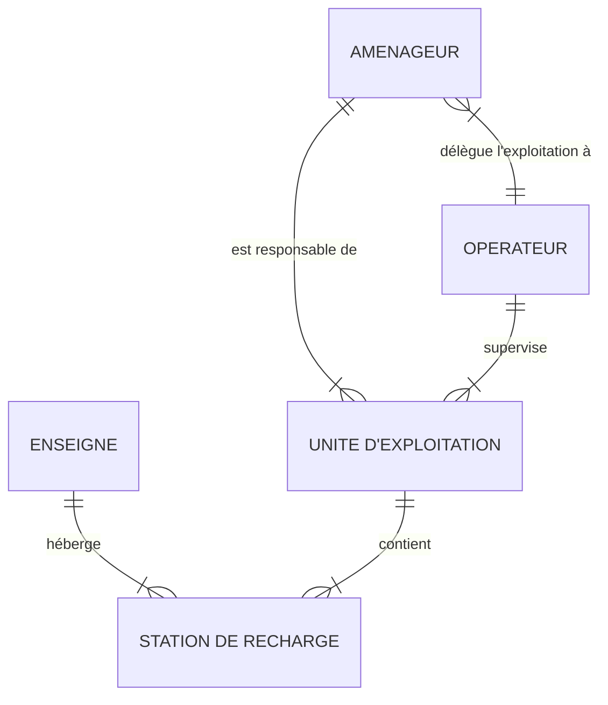

Une station de recharge est associée à un seul opérateur (au travers de son unité d'exploitation), un seul aménageur et une seule enseigne. De même, une unité d'exploitation n'est gérée que par un seul aménageur et supervisée par un seul opérateur.

On notera que le terme réseau utilisé à la fois dans la définition de l'enseigne et dans celle de l'unité d'exploitation ne fait pas référence aux mêmes réseaux. Par exemple, une enseige pourra faire référence à une chaîne d'entités commerciales répartie géographiquement alors qu'une unité d'exploitation pourra faire référence à l'ensemble du périmètre géré par un opérateur.

### Structure dynamique

La structure dynamique représente l'état courant et l'utilisation (recharge) des `points de recharge`. On distingue deux notions :

- **statut** : état instantané d'un point de recharge (occupation, fonctionnement)
- **session** : session de recharge effective d'un véhicule (durée, énergie)

Les `statuts` correspondent aux évènements (instantanés) qui affectent l'utilisation des `points de recharge`.
Les `sessions` correspondent aux périodes temporelles associées aux recharges des véhicules.

Les deux notions ne sont pas indépendantes. Par exemple, le démarrage d'une session se traduit par un `statut` correspondant à un évènement de passage du `point de recharge` dans un état "occupé".

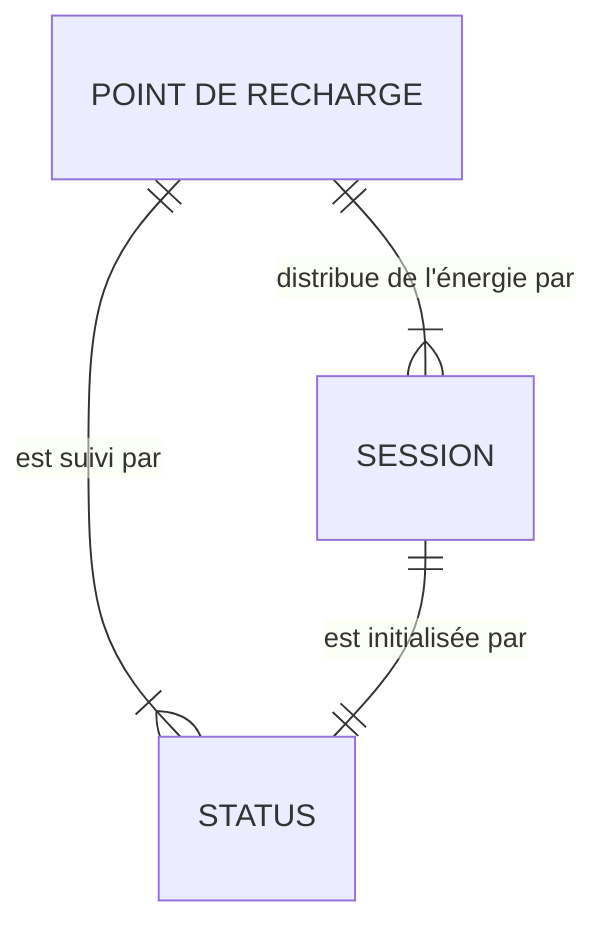

Les `statuts` sont associés aux `sessions` mais peuvent également signaler d'autres évènements comme par exemple une panne d'un `point de recharge` ou sa remise en service.

### Structure globale

Le modèle ci-dessous regroupe l'ensemble des vues précédentes.

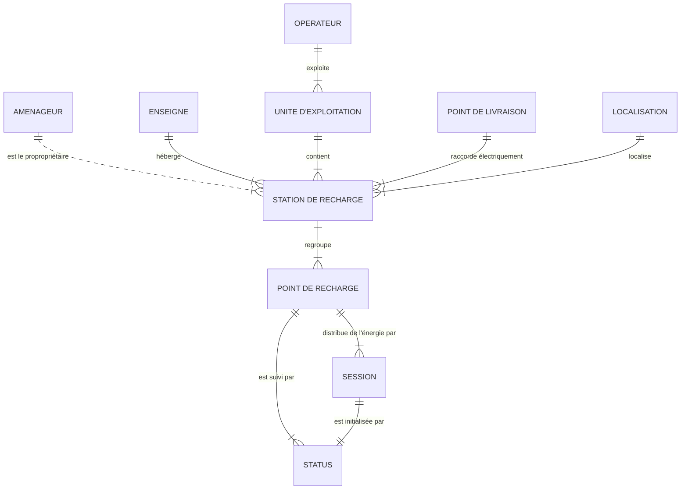

## Données détaillées

Ce chapitre présente les informations associées à chacune des entités définies.

>*Le formalisme utilisé consiste à représenter ces informations sous la forme d'une liste d'attributs.*
>
>*Chacun des attributs représenté par un nom est défini par trois paramètres :*
>
>- *type : format de l'attribut (ex. string pour une chaîne de caractères)*
>- *libellé : le nom de l'attribut*
>- *rôle : le rôle de l'attribut pour l'entité:*
>   - *la lettre "I" indique que l'attribut est l'identifiant de l'entité (l'attribut est unique et obligatoire)*
>   - *la lettre "M" indique que l'attribut est obligatoire.*

Les attributs sont définis par le PAN dans le [Schéma de données IRVE statique](https://schema.data.gouv.fr/etalab/schema-irve-statique/2.3.1/documentation.html) ainsi que dans le [Schéma de données IRVE dynamique](https://schema.data.gouv.fr/etalab/schema-irve-dynamique/2.3.1/documentation.html) pour les statuts.

Ces deux schémas fournissent une définition de chaque attribut qui n'est pas rappelée ici.

Le modèle de données Qualicharge respecte (sauf exception indiquée explicitement) la structuration définie dans les schémas de données.

### Opérateur

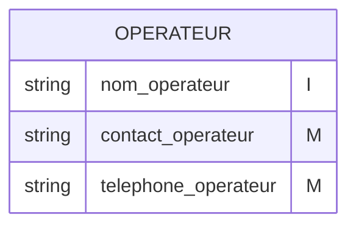

L'opérateur est identifié par son nom.

> :bulb: Les attributs sont obligatoires pour Qualicharge contrairement au schéma de données IRVE

### Aménageur

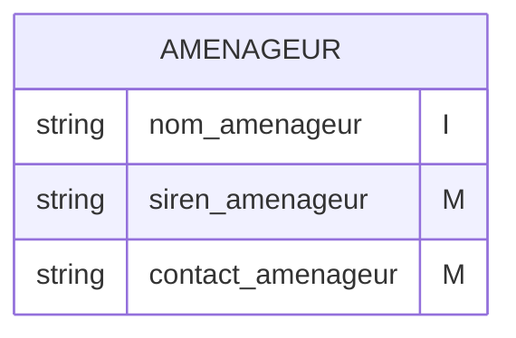

L'aménageur est identifié par son nom.

> :bulb: Les attributs sont obligatoires pour Qualicharge contrairement au [Schéma de données IRVE](https://schema.data.gouv.fr/etalab/schema-irve-statique/2.3.1/documentation.html)

### Enseigne

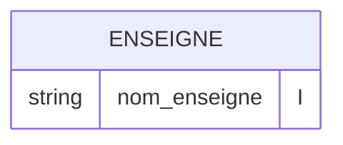

> :bulb: Il est obligatoire pour Qualicharge contrairement au [Schéma de données IRVE](https://schema.data.gouv.fr/etalab/schema-irve-statique/2.3.1/documentation.html)

### Unité d'exploitation

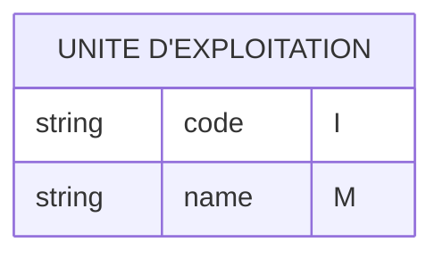

L'entité `unité d'exploitation` est identifié par son [code](https://www.data.gouv.fr/fr/datasets/liste-des-prefixes-didentifiants-dinfrastructures-de-recharge-ouvertes-au-public-et-de-contrats-de-services-donnant-acces-aux-infrastructures-de-recharge-ouvertes-a-litinerance/).
L'attribut `name` est le nom de l'unité d'exploitation.

Ces attributs ne sont pas définis dans le [Schéma de données IRVE](https://schema.data.gouv.fr/etalab/schema-irve-statique/2.3.1/documentation.html).

> :bulb: Le code de l'`unité d'exploitation` est indiqué explicitement dans les identifiants des `stations de recharge` et des `points de recharge` après les deux premiers caractères "FR" (codification AFIREV).

### Point de livraison

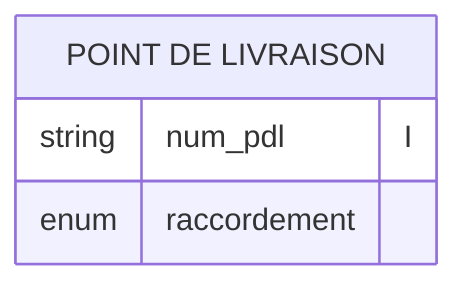

L'entité `point de livraison` est identifié par un code (attribut num_pdl).

> :bulb: L'attribut `num_pdl` est obligatoire pour Qualicharge contrairement au schéma de données IRVE

### Localisation

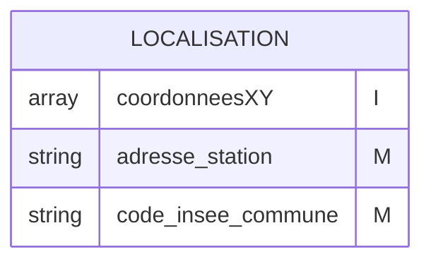

> :bulb: L'attribut `code_insee_commune` est obligatoire pour Qualicharge contrairement au schéma de données IRVE

### Station de recharge

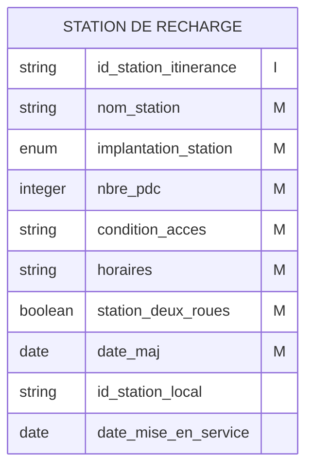

L'identifiant d'une `station de recharge` suit une codification spécifique ([code AFIREV](https://afirev.fr/fr/informations-generales/)).

### Point de recharge

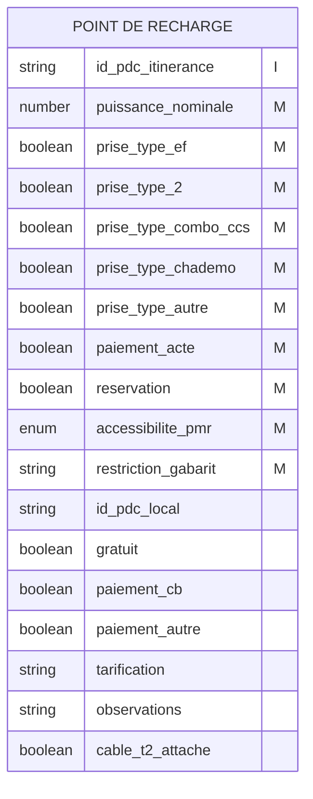

L'identifiant d'un `point de recharge` suit une codification spécifique ([code AFIREV](https://afirev.fr/fr/informations-generales/)).

### Status

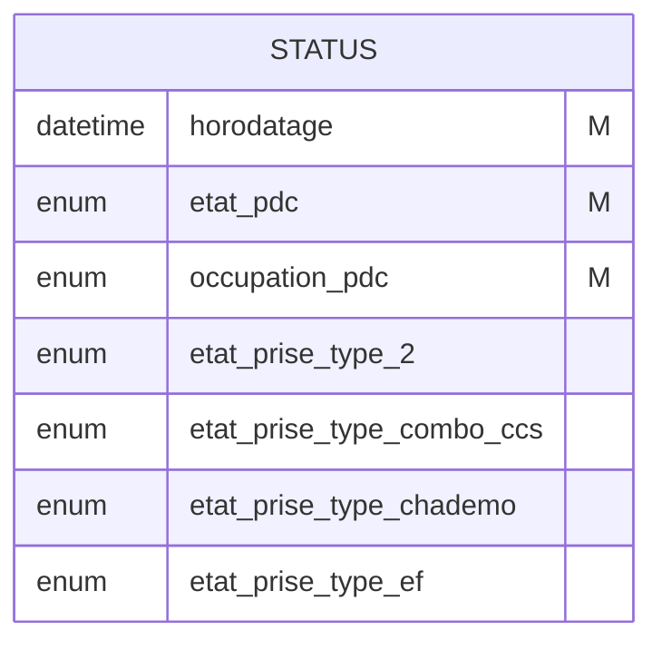

Un `status` ne dispose pas d'identifiant unique. La contrainte d'unicité est associée à la relation avec le `point de recharge` :

- on ne peut avoir deux `status` associés au même `point de recharge` et avec le même `horodatage`.

### Session

Les `sessions`ne sont pas définies dans le schéma de données dynamique.
Les attributs associés sont les suivants :

- **start** : Indique la date et l'heure du début de la session, formaté selon la norme ISO 8601
- **end** : Indique la date et l'heure d ela fin de la session, formaté selon la norme ISO 8601
- **energy** : Energie totale en kWh recue par le véhicule pendant la session de recharge

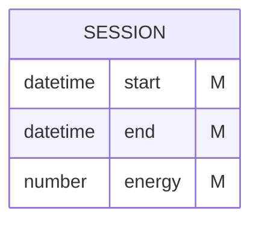

Une `session` ne dispose pas d'identifiant unique. La contrainte d'unicité est associée à la relation avec le `point de recharge` :

- on ne peut avoir deux `sessions` associés au même `point de recharge` avec un chevauchement temporel.

## Représentation globale

Le modèle ci-dessous regroupe l'ensemble des données présentées.

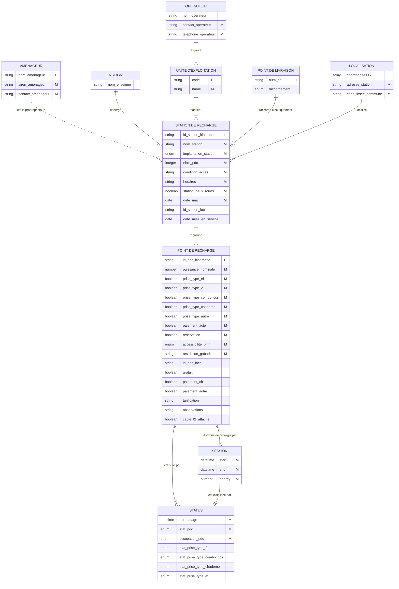
