# Comprendre les données Qualicharge

Les données Qualicharge sont définies unitairement (champ par champ) dans les schémas de données [IRVE statique](https://schema.data.gouv.fr/etalab/schema-irve-statique/2.3.1/documentation.html) et [IRVE dynamique](https://schema.data.gouv.fr/etalab/schema-irve-dynamique/2.3.1/documentation.html).

Ces définitions sont également complétées dans la [documentation des API de Qualicharge](https://fabrique-numerique.gitbook.io/qualicharge) par la description des contrôles et règles appliquées.

Ce document, complémentaires aux deux précédents, présente la structuration des données et leur interdépendance.

Le formalisme utilisé est celui des modèles conceptuels de données et en particulier le modèle entité-association (voir le [guide data.gouv.fr: "bien documenter un jeu de données"](https://guides.data.gouv.fr/guides-open-data/guide-qualite/documenter-des-donnees/bien-documenter-un-jeu-de-donnees)).

Il est à noter qu'un modèle conceptuel aborde la sémantique des données. Il ne préjuge pas des implémentations physiques mises en oeuvre (ex structure de base de données). Celles-ci font l'objet de représentations dédiées (modèle physique de données).

## Structure des données

### Structure de recharge

Les données Qualicharge sont organisées autour des notions de `station de recharge` et de `point de recharge`.

Ces notions correspondent à celles définies par la réglementation AFIR (Alternative Fuels Infrastructure - [règlement UE 2023/1804 du 13/09/2023](https://eur-lex.europa.eu/eli/reg/2023/1804/oj)):

  "***point de recharge**: une interface fixe ou mobile, sur réseau ou hors réseau, qui permet de transférer de l’électricité vers un véhicule électrique et qui, bien qu’elle puisse être équipée d’un ou de plusieurs connecteurs pour prendre en charge différents types de connecteurs, n’est capable de recharger qu’un seul véhicule électrique à la fois, à l’exclusion des dispositifs d’une puissance de sortie inférieure ou égale à 3,7 kW dont la fonction principale n’est pas de recharger des véhicules électriques*"

  "***station de recharge**: une installation physique en un lieu spécifique, composée d’un ou de plusieurs points de recharge*"

La notion de point de recharge est explicite dans sa formulation mais peut être difficle à implémenter lorsque deux connecteurs ne sont ni totalement indépendants, ni totalement dépendants.

> Exemple :
>
> Une borne dessert deux places de parking. Elle est équipée de 3 connecteurs.
>
> - Si deux de ces connecteurs ne peuvent être utilisés indépendamment l'un de l'autre, on considèrera deux points de recharge (l'un associé aux deux connecteurs dépendants, l'autre associé au troisième connecteur).
> - Si les trois connecteurs peuvent être utilisés indifféremment sur les deux places de parking (et simultanément), on devra considérer trois points de recharge.

La notion de station de recharge nécessite également une explication complémentaire :

- la station de recharge est définie dans la règlementation AFIR au travers des informations qui lui sont associées. On peut ainsi la définir comme étant un regroupement de points de recharge partageant des informations identiques. Par exemple :
  - une même localisation géographique (coordonnées),
  - un raccordement électrique commun (Point de Livraison)
  - un même rattachement administratif (propriétaire, opérateur, aménageur),
  - des conditions tarifaires identiques,
  - des propriétés communes (accessibilité, horaires)

  Ainsi, par exemple, deux points de recharge ne partageant pas la même localisation ne pourront être associés à la même station.
  
  Le périmètre d'une station reste a l'appréciation des opérateurs et aménageurs (il peut être restreint à quelques points de recharge ou au contraire regrouper plusieurs dizaines de points de recharge).

  Dans le cadre de Qualicharge la notion de station est conforme à la notion présentée dans la règlementation AFIR.

Cette structure de recharge peut être représentée sous la forme d'un modèle entité-association :

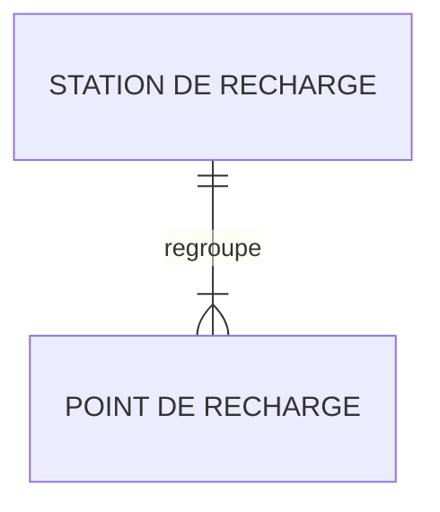

> *Chaque entité est représentée par un nom et modélisé par une "boîte".*
> *L'association entre deux entités est représentée par une ligne dont les extrémités expriment la "cardinalité" :*
>
> | *représentation* | *signification*   |
> | ---------------- | ----------------- |
> | \|\|             | *Un seul*         |
> | }\|              | *Un ou plusieurs* |

Ce modèle exprime qu'une station de recharge regroupe un ou plusieurs points de recharge et qu'un point de recharge n'appartient qu'à une seule station de recharge.

***Nota 1:***

La règlementation AFIR définit la notion complémentaire de parc de recharge:

- "***parc de recharge**: une ou plusieurs stations de recharge en un lieu spécifique*"

Le parc de recharge ne fait référence à aucune activité de gestion mais est associé exclusivement aux exigences règlementaires portant sur un lieu. Ainsi un parc regroupe par exemple toutes les stations d'une aire de service autoroutière ou bien d'une gare ou d'un aéroport. Il reflète en ce sens le besoin usager de recharge en un lieu donné.

La notion de parc de recharge est utilisée dans Qualicharge pour l'évaluation des exigences AFIR. Elle n'est pas abordée dans cette présentation.

***Nota 2:***

Les protocoles OCPP et OCPI utilisent également une terminologie similaire mais qui peut recouvrir des notions différentes :

- EVSE (Electric Vehicle Supply Equipment): Ce terme correspond à la notion de point de recharge et est utilisé à la fois par les protocoles OCPI et OCPP.
- Charging Station : Ce terme est utilisé par OCPP pour désigner l'équipement physique qui intègre plusieurs EVSE. Cette notion n'est pas utilisée dans OCPI ni dans Qualicharge.
- Location : La notion de Location est définie dans OCPI et correspond à un ensemble d'EVSE situés en un même lieu. Cette notion n'existe pas directement dans OCPP mais y apparaît néanmoins sous le terme de Charging Location au niveau du CSMS (Charging Station Management Software) associé pour gérer un ensemble d'EVSE. Cette notion est équivalente à la notion de Station dans Qualicharge.

### Interface véhicule

Le point de recharge est associé à deux entités associées au véhicule à recharger :

- "***connecteur** : interface physique entre le point de recharge et le véhicule qui permet l’échange de l’énergie électrique*"
- "***place de recharge** : Emplacement de stationnement d'un véhicule dédié à la recharge*"

Le modèle ci-dessous représente l'interface d'un point de recharge avec le véhicule :

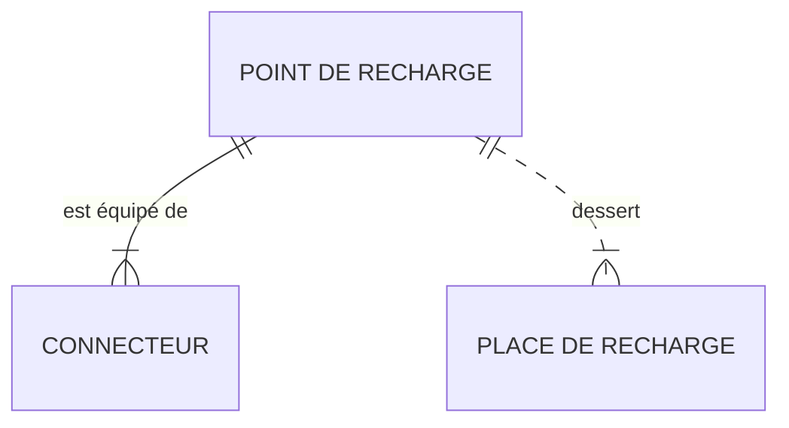

Un point de recharge est équipé de un ou plusieurs connecteurs et dessert une ou plusieurs places de recharge.
Le nombre de places de recharge est consolidé au niveau de la station de recharge (attribut `nbre_pdc`).

### Structure physique

L'intégration d'une station de recharge dans son environnement est représentée par deux notions complémentaires :

- **localisation** : localisation géographique et administative d'une station
- **point de raccordement** : référence géographique ou se situe le point de connexion (organe de coupure avec les ouvrages électriques du réseau)

Ces deux notions sont associées à la station :

- une station est associée à une seule localisation physique et à un seul raccordement au réseau électrique.

Le modèle associé est le suivant :

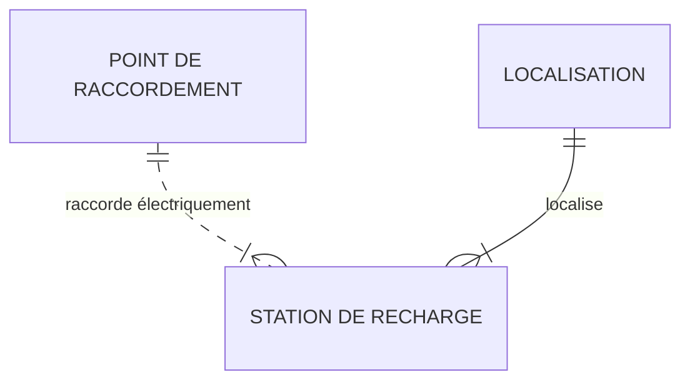

Ce modèle prend en compte plusieurs configurations possibles :

- plusieurs stations avec un même point de raccordement et une même localisation (ex. une station par niveau d'un parking sur plusieurs niveaux),
- plusieurs stations avec un même point de raccordement et des localisations différentes (ex. stations d'un même site),
- plusieurs stations avec des points de raccordement différents et une même localisation (ex. augmentation de capacité par ajout d'une station et d'un point de raccordement)
  
Il est à noter que ces deux notions sont associées à la station de recharge et non au point de recharge.
Ceci implique que deux points de recharge d'une même station ne peuvent avoir des localisations différentes ni être raccordés à des points de raccordement différents.

> :bulb: Deux modes de raccordement électrique sont possibles : un raccordement direct à un point de livraison du réseau électrique public ou bien un raccordement indirect dans le cas d'une intégration à un sous-réseau privé.

### Structure de gestion

La gestion des stations de recharge est effectuée par deux catégories principales d'acteurs :

- **aménageur** : entité publique ou privée propriétaire des infrastructures (définition du schéma de données),
- **opérateur** : personne qui exploite l'infrastructure de recharge pour le compte d'un aménageur dans le cadre d'un contrat ou pour son propre compte s'il est l'aménageur (définition du schéma de données).

Un acteur public ou privé peut cumuler le rôle d'aménageur et celui d'opérateur.

Elle introduit également deux notions :

- **enseigne** : nom commercial du réseau (définition du schéma de données)
- **unité d'exploitation** : réseau d’infrastructures de recharge exploité par un unique opérateur d’infrastructure de recharge et accessible à l’itinérance par une seule connexion informatique ([définition AFIREV](https://afirev.fr/fr/informations-generales/))

Le modèle ci-dessous représente la gestion des stations.

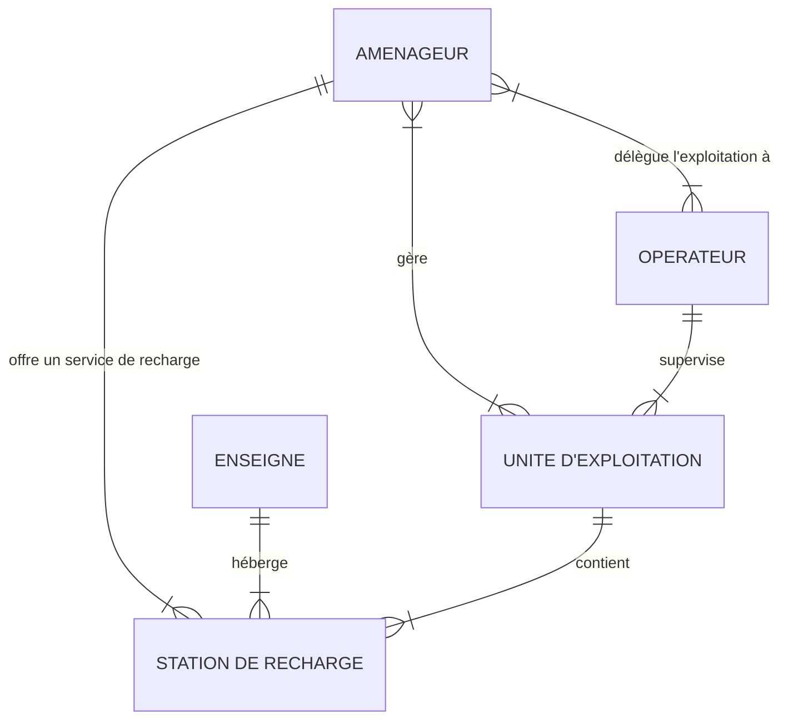

Une station de recharge est associée à un seul opérateur (au travers de son unité d'exploitation), un seul aménageur et une seule enseigne. De même, une unité d'exploitation regroupe un ou plusieurs aménageurs. Elle est supervisée par un seul opérateur, un aménageur ne peut donc confier l'exploitation d'un réseau de stations d'une même unité d'exploitation à plusieurs opérateurs.

Plusieurs organisations sont possibles :

- l'aménageur est son propre opérateur. Dans ce cas une seule unité d'exploitation lui est rattachée,
- l'aménageur dispose d'un réseau de stations et gère ce réseau au travers d'une unité d'exploitation dédiée,
- l'aménageur dispose d'un réseau de stations et gère ce réseau au travers de plusieurs unités d'exploitation dédiées,
- un groupement d'aménageurs gère son réseau de stations au travers d'une unité d'exploitation dédiée comprenant les aménageurs de ce groupement
- un aménageur disposant d'un parc réduit s'intègre dans une unité d'exploitation déjà existante (gérée par exemple par un opérateur)

On notera que le terme réseau utilisé à la fois dans la définition de l'enseigne et dans celle de l'unité d'exploitation ne fait pas référence aux mêmes réseaux. Par exemple, une enseige pourra faire référence à une chaîne d'entités commerciales répartie géographiquement alors qu'une unité d'exploitation pourra faire référence à l'ensemble du périmètre géré par un opérateur.

### Structure dynamique

Un point de recharge est caractérisé à un instant donné par son état.
  
Six états sont définis :

- occupé: Cet état est exclusivement dédié aux sessions de recharge effective (avec consommation d'énergie)
- réservé : Cet état indique que le point de recharge est en fonctionnement et disponible uniquement pour la personne ayant effectué une réservation
- libre: Le point de recharge est en fonctionnement et non occupé et pendant la période d'ouverture
- hors service: Le point de recharge n'est pas utilisable pour la recharge. Il peut correspondre à une mise à l'arrêt (ex. pour maintenance préventive) ou à un arrêt intempestif
- transitoire: Etat intermédiaire de courte durée utilisé lorsque le passage d'un état à un autre n'est pas instantané (ex états OCPP 'Preparing', 'Finishing')
- inconnu: Lorsqu'aucun des autres états ne peut être identifié.
  
> Nota :
> L'état transitoire est optionnel dans Qualicharge. Il est dans ce cas implicitement intégré à l'état qui le précède.
> Les périodes d'ouverture / fermeture ne sont pas gérés dans les états Qualicharge
  
La structure dynamique des `points de recharge` est représentée par deux notions :

- **statut** : évènement (instantané) qui correspond à un changement d'état d'un `point de recharge`
- **session** : caractérisation de chaque état occupé (ex. durée, énergie)

Les deux notions ne sont pas indépendantes. Par exemple, le démarrage d'une session se traduit par un `statut` correspondant à un évènement de passage du `point de recharge` dans un état "occupé".

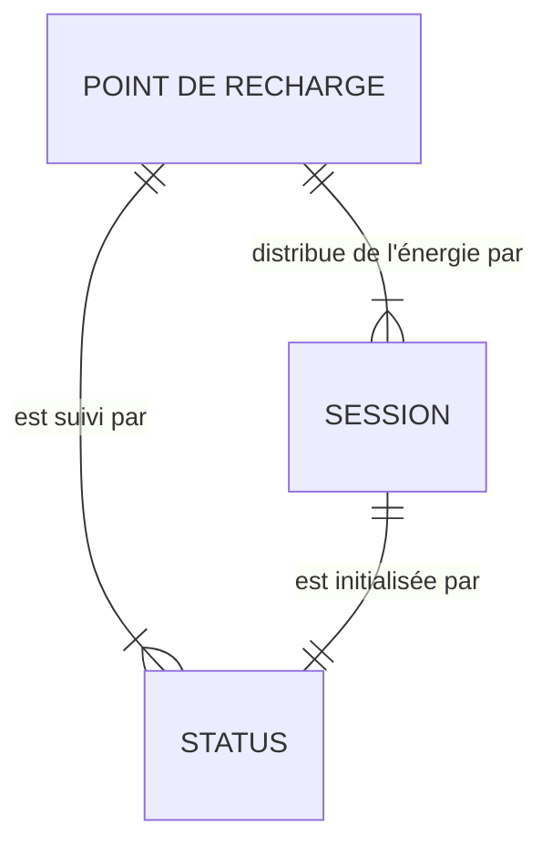

Les `statuts` sont associés aux `sessions` mais peuvent également signaler d'autres évènements comme par exemple une panne d'un `point de recharge` ou sa remise en service.
Les `statuts` de passage vers un état transitoire sont optionnels pour Qualicharge.

### Structure globale

Le modèle ci-dessous regroupe l'ensemble des vues précédentes.

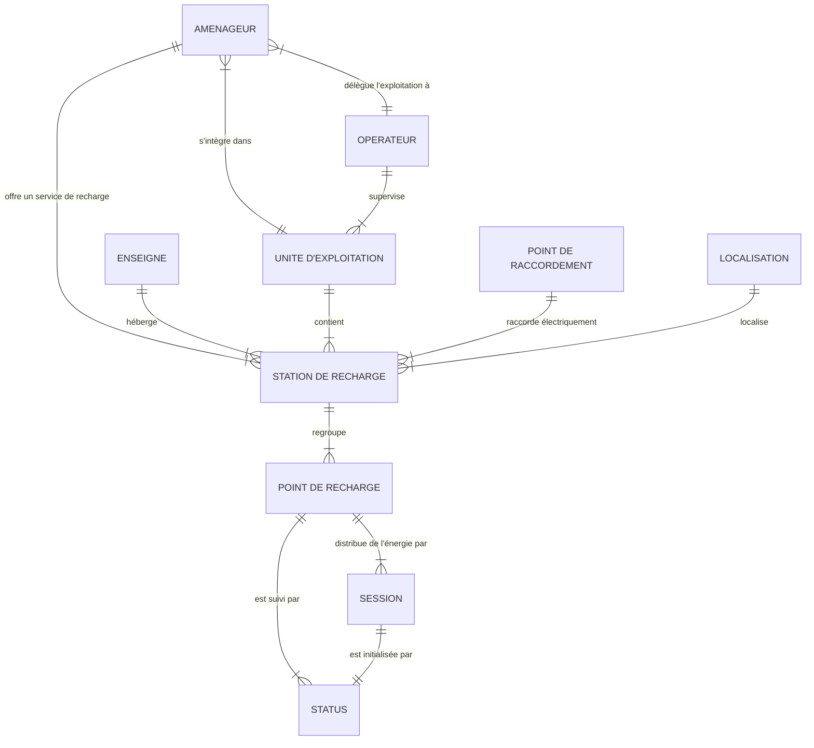

## Données détaillées

Ce chapitre présente les informations associées à chacune des entités définies.

>*Le formalisme utilisé consiste à représenter ces informations sous la forme d'une liste d'attributs.*
>
>*Chacun des attributs représenté par un nom est défini par trois paramètres :*
>
>- *type : format de l'attribut (ex. string pour une chaîne de caractères)*
>- *libellé : le nom de l'attribut*
>- *rôle : le rôle de l'attribut pour l'entité:*
>   - *la lettre "I" indique que l'attribut est l'identifiant de l'entité (l'attribut est unique et obligatoire)*
>   - *la lettre "M" indique que l'attribut est obligatoire.*

Les attributs sont définis par le PAN dans le [Schéma de données IRVE statique](https://schema.data.gouv.fr/etalab/schema-irve-statique/2.3.1/documentation.html) ainsi que dans le [Schéma de données IRVE dynamique](https://schema.data.gouv.fr/etalab/schema-irve-dynamique/2.3.1/documentation.html) pour les statuts.

Ces deux schémas fournissent une définition de chaque attribut qui n'est pas rappelée ici.

Le modèle de données Qualicharge respecte (sauf exception indiquée explicitement) la structuration définie dans les schémas de données.

### Opérateur

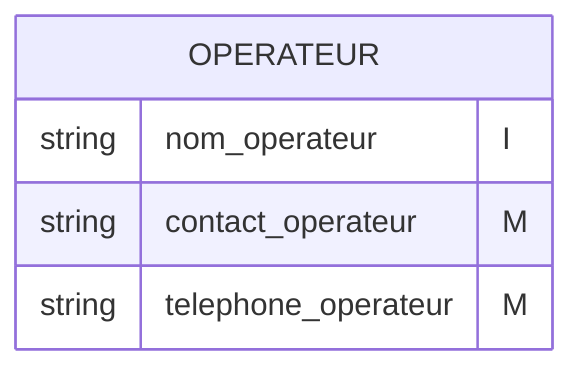

L'opérateur est identifié par son nom.

> :bulb: Les attributs sont obligatoires pour Qualicharge contrairement au schéma de données IRVE

### Aménageur

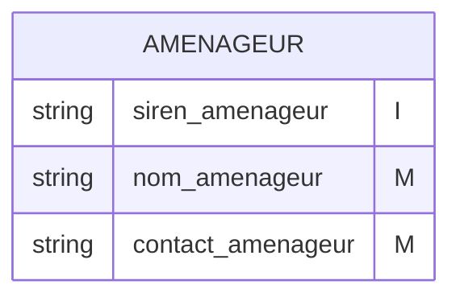

L'aménageur est identifié par son code SIREN.

> :bulb: Les attributs sont obligatoires pour Qualicharge contrairement au [Schéma de données IRVE](https://schema.data.gouv.fr/etalab/schema-irve-statique/2.3.1/documentation.html)

### Enseigne

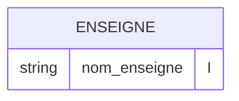

> :bulb: Il est obligatoire pour Qualicharge contrairement au [Schéma de données IRVE](https://schema.data.gouv.fr/etalab/schema-irve-statique/2.3.1/documentation.html)

### Unité d'exploitation

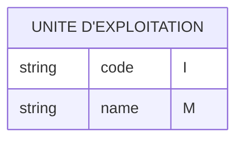

L'entité `unité d'exploitation` est identifié par son [code](https://www.data.gouv.fr/fr/datasets/liste-des-prefixes-didentifiants-dinfrastructures-de-recharge-ouvertes-au-public-et-de-contrats-de-services-donnant-acces-aux-infrastructures-de-recharge-ouvertes-a-litinerance/).
L'attribut `name` est le nom de l'unité d'exploitation.

Ces attributs ne sont pas définis dans le [Schéma de données IRVE](https://schema.data.gouv.fr/etalab/schema-irve-statique/2.3.1/documentation.html).

> :bulb: Le code de l'`unité d'exploitation` est indiqué explicitement dans les identifiants des `stations de recharge` et des `points de recharge` après les deux premiers caractères "FR" (codification AFIREV).

### Point de raccordement

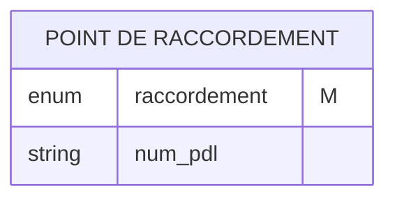

L'entité `point de raccordement` est identifiée par un code unique (attribut `num_pdl`) lorsque l'attribut `raccordement` a la valeur "Direct".

> :bulb: L'attribut `raccordement` est obligatoire pour Qualicharge contrairement au schéma de données IRVE

### Localisation

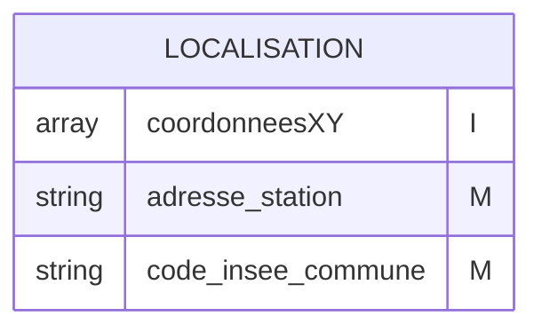

> :bulb: L'attribut `code_insee_commune` est obligatoire pour Qualicharge contrairement au schéma de données IRVE

### Station de recharge

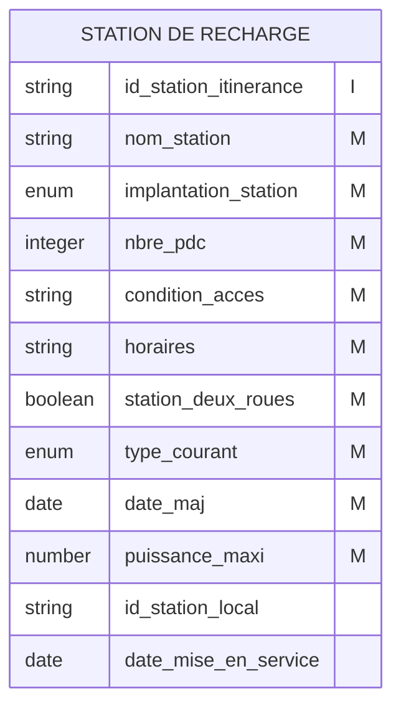

L'identifiant d'une `station de recharge` suit une codification spécifique ([code AFIREV](https://afirev.fr/fr/informations-generales/)).

> :bulb: L'attribut `type_courant` n'est pas présent dans le schéma de données IRVE. Il est calculé à partir du `type_courant` de chaque `point de recharge` (la valeur sera 'DC' si un des `points de charge` est de type 'DC')
> L'attribut `puissance_maxi` correspond à la puissance maximale qui peut être délivrée à un instant donné (non présent dans le schéma de données IRVE). Il est actuellement calculé à partir de la `puissance_nominale` de chaque `point de charge` (somme). Dans une version ultérieure, il devra être documenté à partir de la capacité installée.
> L'attribut `nbre_pdc` représente le nombre de points de recharge de la station qui peuvent être utilisés de façon simultanée. Il ne peut être supérieur :
>
>- au nombre d'entités `point de recharge` associées à l'entité `station`,
>- au nombre maximum de sessions simultanées sur les points de recharge de la station,
>- au nombre de places physiques de véhicules définies pour la station

### Point de recharge

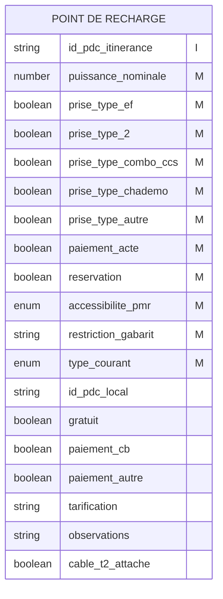

L'identifiant d'un `point de recharge` suit une codification spécifique ([code AFIREV](https://afirev.fr/fr/informations-generales/)).

> :bulb: L'attribut `type_courant` est actuellement calculé à partir de la puissance nominale et du type de connecteurs ( `type_courant` est 'DC' si `puissance_nominale` >= 50 ou si `prise_type_combo_ccs` est vraie ou si `prise_type_chademo` est vraie). Dans une version ultérieure, il devra être documenté à partir des caractéristiques techniques du `point de recharge`.

### Status

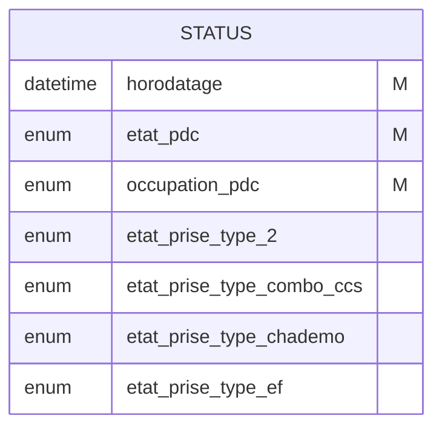

Un `status` ne dispose pas d'identifiant unique. La contrainte d'unicité est associée à la relation avec le `point de recharge` :

- on ne peut avoir deux `status` associés au même `point de recharge` et avec le même `horodatage`.

L'attribut `occupation_pdc` peut prendre quatre valeurs : 'occupe', 'reserve', 'libre', 'inconnu'.
L'attribut `etat_pdc` peut prendre trois valeurs : 'en_service', 'hors_service', 'inconnu'

Les combinaisons de valeurs correspondent aux évènements de passage dans les états suivants :

| etat_pdc     | occupation_pdc | passage vers      |
| ------------ | -------------- | ----------------- |
| en_service   | occupe         | état occupé       |
| en_service   | reserve        | état réservé      |
| en_service   | libre          | état libre        |
| en_service   | inconnu        | état transitoire  |
| hors_service | inconnu        | état hors service |
| hors_service | reserve        | état hors service |
| hors_service | libre          | état hors service |
| inconnu      | inconnu        | état inconnu      |
| inconnu      | reserve        | état inconnu      |
| inconnu      | libre          | état inconnu      |

En particulier, les combinaisons 'hors_service' et 'occupe' ainsi que 'inconnu' et 'occupe' sont interdites.

### Session

Les `sessions`ne sont pas définies dans le schéma de données dynamique.
Les attributs associés sont les suivants :

- **start** : Indique la date et l'heure du début de la session, formaté selon la norme ISO 8601
- **end** : Indique la date et l'heure de la fin de la session, formaté selon la norme ISO 8601
- **energy** : Energie totale en kWh recue par le véhicule pendant la session de recharge

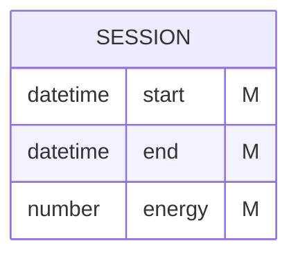

Une `session` ne dispose pas d'identifiant unique. La contrainte d'unicité est associée à la relation avec le `point de recharge` :

- on ne peut avoir deux `sessions` associés au même `point de recharge` avec un chevauchement temporel.

## Représentation globale

Le modèle ci-dessous regroupe l'ensemble des données présentées.

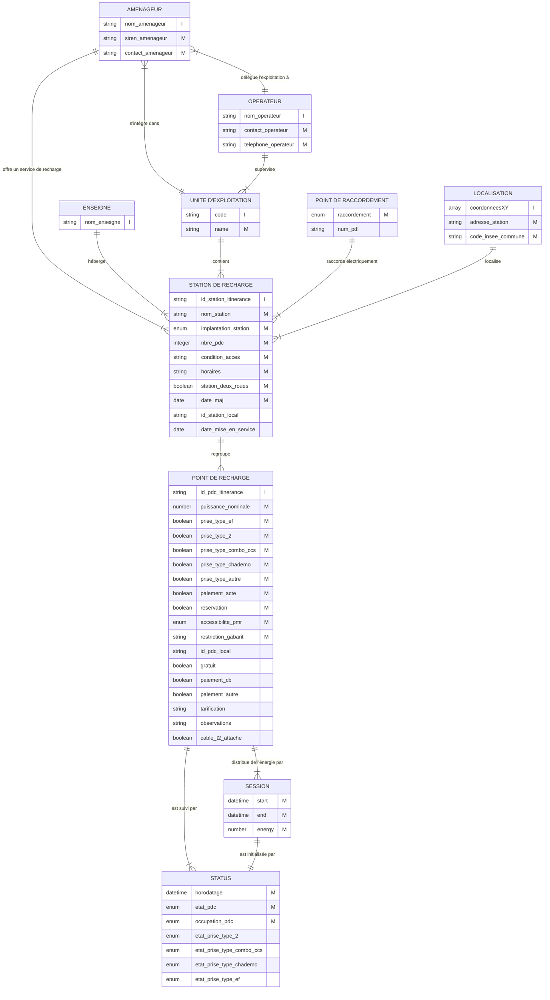
