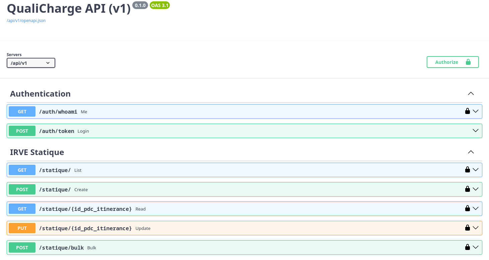

### Standards

QualiCharge API is continuously updated in our
[staging instance](https://staging.qualicharge.incubateur.net/api/v1/docs/). We
provide a [Swagger](https://swagger.io/docs/) interface to ease API exploration
and testing. As Swagger uses the
[OpenAPI schema](https://swagger.io/specification/) we designed, feel free to
use it in your developments.

### Ressources

:book: QualiCharge OpenAPI schema (staging):
[https://staging.qualicharge.incubateur.net/api/v1/openapi.json](https://staging.qualicharge.incubateur.net/api/v1/openapi.json)

:gear: QualiCharge API root URL (staging):
[https://staging.qualicharge.incubateur.net/api/v1/](https://staging.qualicharge.incubateur.net/api/v1/)
