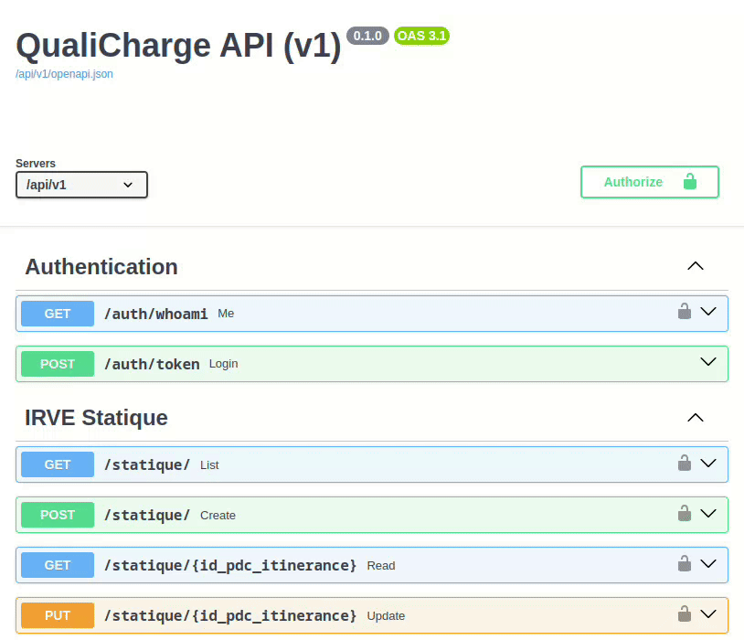

# Authentification

> Every QualiCharge API endpoint requires users to be authenticated. You will
> need to ask an administrator to create an account for you and then login to
> the API to make queries.

## A few words about permissions

Before digging into the core authentication flow, you need to know a few things
about permissions.

Having access to the API does not mean that you will be able to perform every
[CRUD action](https://en.wikipedia.org/wiki/Create,_read,_update_and_delete) on
every object. Instead API permissions follow two simple rules:

1. An organisation (_aka_ group of API users) is authorized to manipulate
   objects related to the **operational units** it has been assigned to. In
   other words, if your organisation is responsible for the `FRXXX` operational
   unit, you won't be able to read or create data for the `FRYYY` operational
   unit.

> :bulb: Operational units are referred using
> [AFIREV's assigned identifiers](https://afirev.fr/en/list-of-assigned-identifiers/).

2. Actions for a registered user are limited to its assigned **scopes**, meaning
   that if your account has only the `static:read` scope, you won't be able to
   query an endpoint requiring the `static:create` scope. API scopes are listed
   below.

| Scope            | Permission                                     | Used               |
| ---------------- | ---------------------------------------------- | ------------------ |
| `static:create`  | create static data (charge points declaration) | :white_check_mark: |
| `static:read`    | read static data (declared charge points)      | :white_check_mark: |
| `static:update`  | update static data (charge points metadata)    | :white_check_mark: |
| `static:delete`  | delete static data (delete charge points)      | :x:                |
| `dynamic:create` | create dynamic data (status or sessions)       | :white_check_mark: |
| `dynamic:read`   | read dynamic data (status or sessions)         | :white_check_mark: |
| `dynamic:update` | update dynamic data (status or session)        | :x:                |
| `dynamic:delete` | delete dynamic data (status or session)        | :x:                |
| `all:create`     | update all type of data (static and dynamic)   | :white_check_mark: |
| `all:read`       | update all type of data (static and dynamic)   | :white_check_mark: |
| `all:update`     | update all type of data (static and dynamic)   | :white_check_mark: |
| `all:delete`     | update all type of data (static and dynamic)   | :x:                |

> :bulb: Some scopes are not used yet as no endpoint requiring those have been
> implemented yet.

## Getting API credentials

First things first, you need to ask for an API account by sending a formal email
request to your QualiCharge's contact. In this request, we invite you to list
every operational unit you are in charge of.

You also need to mention which **scope(s)** you intend to have for your
organisation (see previous section).

Example request:

```
Hi there!

I would need to create an account for my ACME Inc. organisation.

We are in charge of the following operational units:

- FRXXX
- FRYYY
- FRZZZ

Ideally I would like to be able to create and view static data.

Best regards!
```

You'll receive your API credentials shortly (_e.g._ 1 or 2 business days).

## Logging in to the API

### Using Swagger UI

We've integrated a OAuth2 password flow to authenticate to QualiCharge API.
Before digging into the code, you can test sent credentials by using the Swagger
UI at `{{ QUALICHARGE_API_ROOT_URL }}/docs`. Here is a screencast of what it
should look like:



Now that you are logged in the Swagger UI, you can try API endpoints right from
your browser! Happy face :sunglasses:

> :bulb: If you are unfamiliar with Swagger, I invite you to read its
> documentation at: [https://swagger.io/docs/](https://swagger.io/docs/)

### Using API Endpoints

> For API query examples, we will use the famous [`curl`](https://curl.se) tool.
> Feel free to substitute this tool by your favorite one such as
> [Postman](https://www.postman.com) or the excellent
> [HTTPie](https://httpie.io) :heart:. When dealing with
> [JSON](https://en.wikipedia.org/wiki/JSON) response, we may also use the
> [`jq`](https://jqlang.github.io/jq/) command from a terminal. Feel free to
> install and use it, it's an amazing tool!

From your terminal, post your `username` and `password` to the
`/api/v1/auth/token`:

```
curl -X POST \
  --data-urlencode "username=USERNAME" \
  --data-urlencode "password=PASSWORD" \
  {{ QUALICHARGE_API_ROOT_URL }}/auth/token
```

> :warning: Substitute `USERNAME` by your real registered user name, `PASSWORD`
> by your associated password and `QUALICHARGE_API_ROOT_URL` by the QualiCharge
> instance root URL you are querying (_e.g._ >
> `https://staging.qualicharge.incubateur.net/api/v1`).

If everything went well (_i.e._ your `username`/`password` combination is
valid), the server expected response should be a JSON object containing the
access token we will use in future authenticated API server requests:

```json
{
  "access_token": "a-very-long-cryptic-string",
  "token_type": "bearer"
}
```

As an example implementation of how to use this token, we can use a little bit
of Bash magic (:sweat_smile:) to store and use it:

```Bash
# This variable will store our access token
declare ACCESS_TOKEN

# Login to the API to set the access token
ACCESS_TOKEN = $( \
    curl -X POST \
      --data-urlencode "username=USERNAME" \
      --data-urlencode "password=PASSWORD" \
      "{{ QUALICHARGE_API_ROOT_URL }}/auth/token" | \
    jq -r .access_token
)

# Check that our access token is properly set
echo "Access token: ${ACCESS_TOKEN}"
```

Now that we've an access token, we can use it in an `Authorization: Bearer` HTTP
header for further authenticated requests. We invite you to test it with the
`/auth/whoami` API endpoint:

```bash
# Make our first query using this access token
curl -X GET \
  "{{ QUALICHARGE_API_ROOT_URL }}/auth/whoami" \
  -H "accept: application/json" \
  -H "Authorization: Bearer ${ACCESS_TOKEN}"
```

Expected JSON response should describe your user account:

```json
{
  "username": "johndoe",
  "email": "john@doe.com",
  "first_name": "John",
  "last_name": "Doe",
  "is_active": true,
  "is_staff": false,
  "is_superuser": false,
  "scopes": ["static:create", "static:read", "static:update"],
  "groups": ["ACME Inc."]
}
```

Now that you are able to login to the API and perform requests, it's time to
explore API endpoints and what you can achieve with them.
