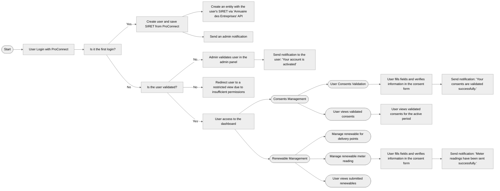

# QualiCharge Dashboard

The dashboard allows operators to manage all of their data related to qualicharge.

## Access the dashboard

The qualicharge dashboard is available from the url:
[http://localhost:8030](http://localhost:8030).

## Shortcut to use Django `manage.py` script

```
./bin/manage <your_command>
```

## Useful commands

### Bootstrap Dashboard Project

```
make bootstrap-dashboard
make run-dashboard
```

### Bootstrap the QualiCharge API 

(this is required to integrate the QualiCharge API with the dashboard):

```
make bootstrap-api
make run-api
```

### Perform a Django migration *(manage.py migrate)*

```
make migrate-dashboard-db
```

### Create Superuser

You can connect with **username: admin** / **password: admin**.
*(The credentials are defined in env.d/dashboard.)*

```
make create-dashboard-superuser
```

### Display Dashboard logs

```
make logs-dashboard
```

### Reset the Dashboard db

```
make drop-dashboard-db
make reset-dashboard-db
```

## Project specific naming convention

For each Django application, the application config label 
(present in my_apps.apps.MyAppConfig) must have the format `qcd_myapp`.

i.e. for the `home` app:  
```python
class HomeConfig(AppConfig):
    """Home app config."""

    default_auto_field = "django.db.models.BigAutoField"
    name = "apps.home"
    label = "qcd_home"  # prefix app name with 'qcd_'
```

## Signals

### apps.consent.signals.handle_new_delivery_point()

A signal is triggered when a `delivery_point` (`apps.core.models.DeliveryPoint`) is created.  
This signal allows the creation of a `consent` (`apps.consent.models.Consent`)  
corresponding to the `delivery_point`.

## Business logic

### WorkFlow



### Consent management

There are three different status types for consents, each with specific management rules:

#### AWAITING

Consent awaiting validation by the user.  
- [x] Users can change consents without restriction.

#### VALIDATED

Consent validated by the user.   
It can only be modified under conditions:
-  [x] users cannot modify validated consents,
-  [x] administrators can change a validated consent to `REVOKED`,
-  [x] modifiable fields are restricted to `status`, `revoked_date`, and `updated_at`,
-  [x] validated consents cannot be deleted.

#### REVOKED

Consent revoked.  
- [x] It cannot be modified.
- [x] It cannot be deleted.

### Renewable management

- Users can add and remove delivery points for which they intend to submit renewable 
energy declarations.
- Quarterly submission of renewable energy declarations is enabled for the preceding 
quarter's data.
- Users can access a comprehensive view of all previously submitted energy declarations.

#### Renewable Energy Declaration Rules:
- The declaration submission date must fall within a specific window: starting from the 
previous quarter's end date up until 'x' days before this end date.
- The declarations must be submitted within the first 'x' days of the current quarter.

#### Environment Variables 

##### RENEWABLE_MIN_DAYS_FOR_METER_READING
- **Type**: Integer
- **Description**: Defines the time window in days before the end of the previous 
quarter during which meter readings are accepted.
- **Example**: If set to 15, meter readings will be accepted within the last 15 days
of the previous quarter.

##### RENEWABLE_OPENING_PERIOD_DAYS
- **Type**: Integer
- **Description**: Specifies the duration (in days) during which users can submit their
energy statements, starting from the first day of the current quarter.
- **Example**: If set to 30, users will have 30 days from the beginning of each quarter 
to submit their energy statements.


## Emails

The third-party service **BREVO** is used to send emails.

### List of Emails Sent

| **Description**          | **Target** | **BREVO Template ID** |
|--------------------------|------------|-----------------------|
| New user creation        | Admins     | 4                     |
| Admin validation         | Users      | 5                     |
| Consents awaiting        | Users      | 6                     |
| Consents validated       | Users      | 3                     |
| Renewable submission     | Users      | 7                     |
| Renewable opening period | Users      | 8                     |

## Django Commands

### Commands used with Cron Job

| **Task**                | **Description**                                                       | **Execution Frequency**                  |
|-------------------------|-----------------------------------------------------------------------|------------------------------------------|
| `syncdeliverypoints`    | Synchronizes delivery points from the QualiCharge API                 | Daily at 02:12 AM                        |
| `renewconsents`         | Renews consents (duplicates expiring consents and generates new ones) | Hourly at 00:42                          |
| `notifawaitingconsents` | Notifies users of their pending consents                              | Every Monday at 05:51 AM                 |
| `notifopening`          | Notifies users when the meter reading submission period begins        | 1st and 10th day of every month at 01:53 |

### Commands used in development only

- `populateentity`: Retrieve company information using its SIRET via the "Annuaire des Entreprises" API
- `seed_consent`: Seed sample consents
- `seed_renewable`: Seed sample renewables

## Third Party Services

### ProConnect

#### Documentation

https://github.com/numerique-gouv/proconnect-documentation/blob/main/doc_fs/README.md

#### Development Information 

To test the connection to ProConnect, you can use:   
- **login:** user@yopmail.com  
- **password:** user@yopmail.com

### API Annuaire des Entreprises API

#### Documentation

https://entreprise.api.gouv.fr/  
https://entreprise.api.gouv.fr/developpeurs

#### Development Information 

For development, use the following SIRET `55204944776279`

## License

This work is released under the MIT License (see LICENSE).
